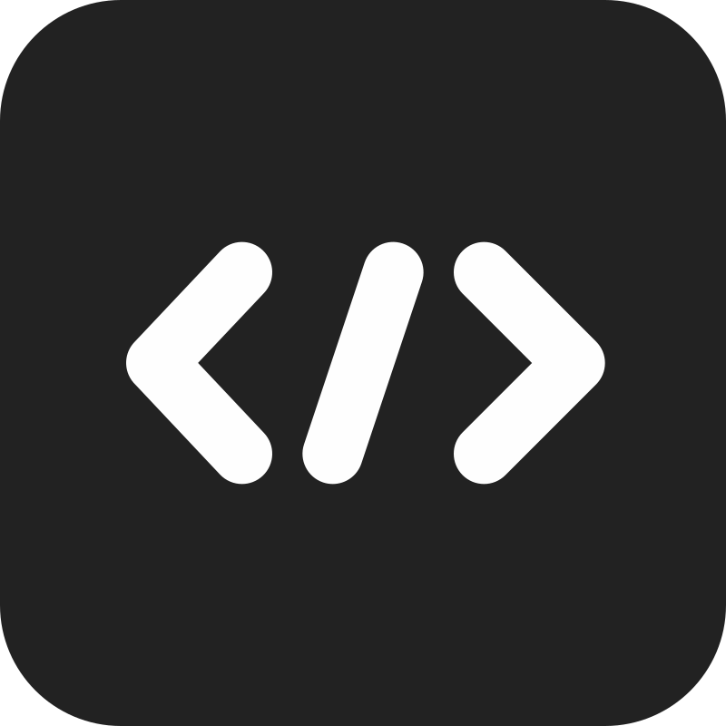

Hi, I'm Martin Broede,

a software developer and musician with an interest in everything related to music, theater, programming, math and science. If you want to learn more about me, feel free to visit [my website](https://broede.dev).

I'm the creator of the open-source monitoring tool **Django Log Lens**, a scheduling software called **MeetSheet** and some other useful as well as completely nonsensical things. 

    
    &nbsp;
    &nbsp;
    
    &nbsp;
    &nbsp;
    

